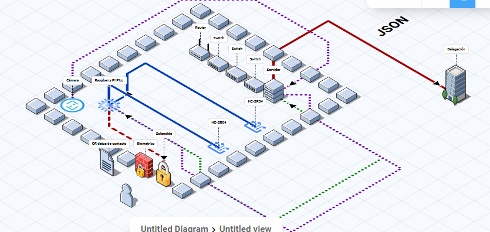

[Ir al indice](index.md)
# Arquitectura física

Para poder implementar el prototipo, es importante que el cuarto de telecomunicaciones cuente con al menos los siguientes elementos:

### Recursos mínimos dentro del cuarto de telecomunicaciones
- Puerta de acceso
- Cámara de vigilancia apuntando a la puerta
- Al menos un servidor
- Conexión al resto de la red empresarial o institucional

> **Nota 1:** Los cuartos de telecomunicaciones del Instituto Mexicano del Seguro Social (IMSS) suelen contar con servidores y conexión a la red institucional; sin embargo, no todos disponen de puerta o cámara. Parte del proyecto consiste en aprovechar de manera óptima los recursos ya existentes en el instituto.

> **Nota 2:** El servidor y la cámara pueden omitirse si se utiliza la arquitectura propuesta del prototipo; sin embargo, es recomendable invertir al menos en cámaras de seguridad y puertas de acceso para garantizar un mayor control y seguridad.

### Elementos externos requeridos

- Raspberry PI Pico ($170 MXN)
- Sensor de huella dactilar ($250 MXN)
- Cerradura de puerta tipo solenoide ($85 MXN)
- Hoja impresa con código QR con datos de contacto del administrador ($1 MXN)
- Dos sensores HC-SR04 ($75 MXN)
- Cables (???)

> **Nota:** Todos los precios indicados corresponden al precio final para el consumidor obtenidos en Septiembre del 2025

**Costo total estimado por cuarto de telcomunicaciones:** $581 MXN